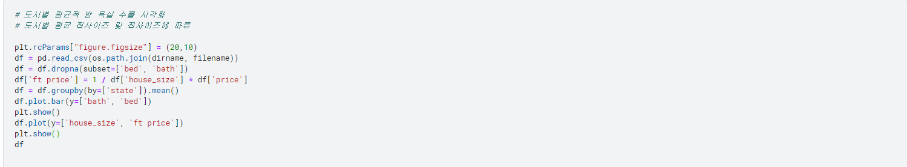

# USA Real Estate Dataset Report

***본 프로젝트는 [kaggle Estate Dataset Report](https:pic/pic/www.kaggle.compic/datasetspic/ahmedshahriarsakibpic/usa-real-estate-dataset)을 참조해서 만들었습니다***
******

## ***학습목표***

1. 미국부동산 정보 파악
2. Python언어를 사용하여 데이터 처리방법을 익힘
3. Pandas라이브러리 활용방법을 익힘  
    - csv파일 데이터 불러오기
    - 데이터 잔 처리방법
    - 필요한 데이터 그룹화방법  
4. matplotlib라이브러리를 이용하여 데이터를 시각화  
    - 데이터를 Bar형태로 시각화
    - 데이터를 선형태로 시각화

## ***Data Column***
  
- ***status***: 판매용 건축중
- ***price***: 집 가격$
- ***bed***: 침실 갯수
- ***bath***: 욕실 화장실 갯수
- ***acre_lot***: 평수
- ***full_address***: 주소
- ***state***: 미국의 주
- ***city***: 도시명
- ***street***: 도로명
- ***zip_code***: 우편번호
- ***house_size***: 집 크기FT
- ***sold_date***: 팔린일자(NaN시 팔리지 않았음을 의미)  

## ***Code***

### ***1. import***

### ***2. CSV 데이터 출력***

.png)

***1. csv_read는 csv파일의 내용을 DataFrame형식으로 읽어준다.***  
***2. df은 방대한 데이터를 가지고 있으므로 head를 이용해 위에서부터 10까지의 컬럼을 출력***  

### ***3. CSV 데이터 Grouping***

.png)

***1. 집 크기별 가격차이가 있으므로 ft price컬럼을 정의 가격정보가 없는 데이터는 제외***  
***2. 각 주 도시 도로명을 그룹핑(도로명만 해도 무관)을 함으로써 그 도로별 ft 평균가격 출력***  

### ***4. 주 별 판매된 건물 수 시각화***

***1. sold_date 값이 없는 데이터는 판매되지 않은 데이터***  
***2. state를 count하여 판매된 데이터를 그래프화***  

### ***5. 주 침실,욕실 평균갯수 및 한 주의 집 사이즈의 FT가격 시각화***

  
  
  

### ***6. 연도 별 팔린 건물 수 및 평균 가격***
  